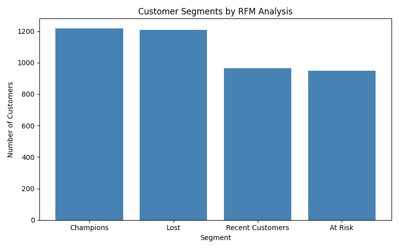

[README_crm.md](https://github.com/user-attachments/files/26664736/README_crm.md)

# Online Retail CRM Segmentation

Customer segmentation analysis of 4,339 online retail customers using RFM (Recency, Frequency, Monetary) analysis. Built with SQL for data extraction and Python for segmentation and visualisation.

---

## What is RFM Analysis?

RFM is a standard customer intelligence technique used by CRM and analytics teams to segment customers based on three dimensions:

- **Recency** — how recently did the customer buy?
- **Frequency** — how often do they buy?
- **Monetary** — how much do they spend?

Each customer is scored 1–4 on each dimension and grouped into segments that drive retention and marketing strategy.

---

## Dataset

- **Source:** Online Retail Dataset — UCI Machine Learning Repository (via Kaggle)
- **Size:** 500,000+ transactions, 4,339 unique customers
- **Period:** December 2010 – December 2011
- **Fields:** InvoiceNo, CustomerID, InvoiceDate, Quantity, UnitPrice, Country

---

## Tools Used

- SQL (SQLite via DB Browser for SQLite) — data cleaning and RFM extraction
- Python (Jupyter Notebook) — scoring, segmentation, and visualisation
- pandas, matplotlib

---

## Process

### Step 1 — SQL: Clean and extract
Removed cancelled orders (InvoiceNo starting with 'C') and rows with missing CustomerIDs. Aggregated transactions per customer to calculate last purchase date, purchase frequency, and total spend.

### Step 2 — Python: Score and segment
Each customer scored 1–4 on recency, frequency, and monetary value using quartile-based scoring. Customers assigned to one of four segments based on their recency and frequency scores.

### Step 3 — Visualise
Segment distribution plotted and saved as a chart.

---

## Results

| Segment | Customers | Description |
|---------|-----------|-------------|
| Champions | 1,219 | Bought recently, buy often, spend the most |
| Lost | 1,207 | Haven't bought in a long time, low frequency |
| Recent Customers | 963 | Bought recently but not yet frequent |
| At Risk | 950 | Used to buy often but haven't recently |

---

## Key Insights

1. **Champions and Lost customers are nearly equal in size** (1,219 vs 1,207) — suggesting the business is acquiring and losing customers at a similar rate, pointing to a retention problem worth investigating
2. **28% of customers are Champions** — a strong base to protect through loyalty programmes and personalised outreach
3. **At Risk customers (950) represent a high-priority segment** — they have proven purchase history but are going cold, making them the best candidates for reactivation campaigns
4. **Recent Customers (963) have growth potential** — they've bought recently but infrequently, suggesting upsell and cross-sell opportunities

---

## Files

| File | Description |
|------|-------------|
| `queries.sql` | SQL used to clean data and extract RFM metrics |
| `rfm_segmentation.ipynb` | Full Python notebook for scoring, segmentation, and visualisation |
| `segment_chart.png` | Bar chart of customer segment distribution |

---

## About Me

Economics graduate with hands-on experience in SQL and Python, building applied analytics projects in the customer intelligence and CRM space.
